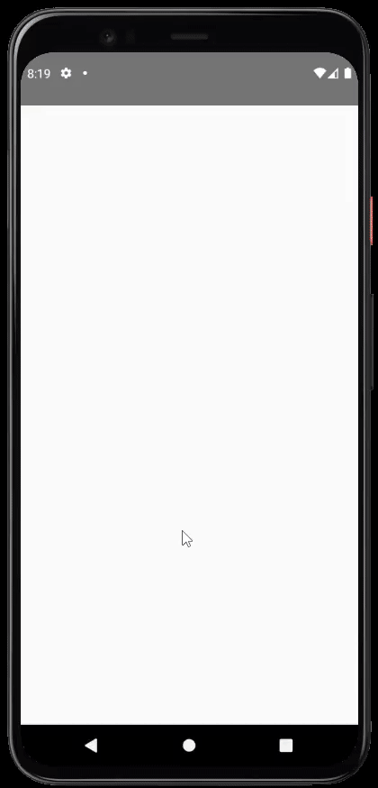
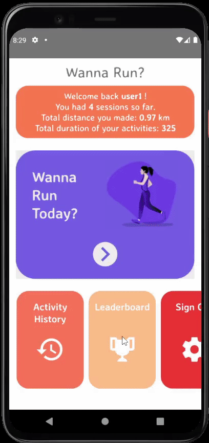
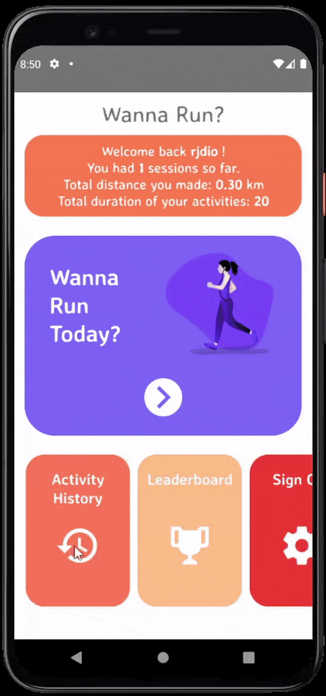

# WannaRun

## Running - Walking Application

### Tracks your activity and shows the results. Lets you share it anywhere you want.

#### You can compete on leaderboard with other users to be the best!

---

## Screen Recordings


Register Screen          |  Login Screen                 | Activity Screen      | 
:-------------------------:|:-------------------------:|:-------------------------:|
  |   |   

History Screen          |  Leaderboard Screen 
:-------------------------:|:-------------------------:
  |   | 

  
## Installation

- [Install React Native](https://reactnative.dev/docs/environment-setup)

```
git clone https://github.com/omuraydin24/WannaRun-ReactNative.git
```

- npm install or yarn install for installing all the dependencies

- start your emulator or connect your physical device then start npm run android/ios(depending on your device)

## Tools & Resources

- [React Native](https://reactnative.dev/)
- [React Navigation](https://reactnavigation.org/) Page hierarchy
- [Firebase Authebtication](https://firebase.google.com/docs/auth/web/start) User authentication
- [Firebase Realtime Database](https://firebase.google.com/docs/database) User's activity database for historical data and leaderboard
- [React Native Maps](https://github.com/react-native-maps/react-native-maps/blob/master/docs/installation.md) Activity tracking, realtime location.
- [React Native Community Geolocation](https://github.com/react-native-geolocation/react-native-geolocation) Activity tracking, realtime location.
- [Axios](https://github.com/axios/axios) Data fetch
- [Formik](https://formik.org/) User registery
- [Yup](https://github.com/jquense/yup) User registery validation
- [React Native Chart Kit](https://github.com/indiespirit/react-native-chart-kit) Bar graph visualization of activity
- [React Native View Shot](https://github.com/gre/react-native-view-shot) Taking picture of a "View" to share
- [Open Weather Map API](https://openweathermap.org/) 
- [React Native Share](https://github.com/react-native-share/react-native-share)
- [React Native Element Timer](https://www.npmjs.com/package/react-native-element-timer)
- [React Native Splash Screen](https://github.com/crazycodeboy/react-native-splash-screen)
- [React Native Vector Icons](https://github.com/oblador/react-native-vector-icons) 
